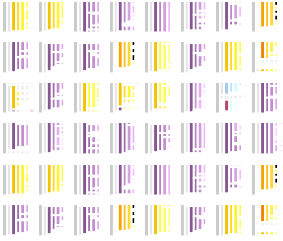

<!-- PROJECT SHIELDS -->
<!--
*** I'm using markdown "reference style" links for readability.
*** Reference links are enclosed in brackets [ ] instead of parentheses ( ).
*** See the bottom of this document for the declaration of the reference variables
*** for build-url, contributors-url, etc. This is an optional, concise syntax you may use.
*** https://www.markdownguide.org/basic-syntax/#reference-style-links
-->
[![Build Status][build-shield]][build-url]
[![Contributors][contributors-shield]][contributors-url]
[![MIT License][license-shield]][license-url]


<!-- PROJECT LOGO -->
<br />
<p align="center">
  <a href="https://github.com/mvanegas10/BioCicle">
    
  </a>

  <h3 align="center">BioCicle</h3>

  <p align="center">
    A Tool for Summarizing and Comparing Taxonomic Reports for Biological Sequence Alignment Results
    <br />
    <a href="http://johnguerra.co/students/2018MeiliVanegasBioCicle/"><strong>Explore the docs »</strong></a>
    <br />
    <br />
    <a href="http://www.youtube.com/watch?feature=player_embedded&v=K_nUJ5exn1A" target="_blank">View Video</a>  
    ·  
    <a href="http://18.206.25.144/">View Demo</a>
    ·
    <a href="https://github.com/mvanegas10/BioCicle/issues">Report Bug</a>
    ·
    <a href="https://github.com/mvanegas10/BioCicle/issues">Request Feature</a>
  </p>
</p>


<!-- TABLE OF CONTENTS -->
## Table of Contents

* [About the Project](#about-the-project)
  * [Built With](#built-with)
* [Getting Started](#getting-started)
  * [Prerequisites](#prerequisites)
  * [Installation](#installation)
* [Usage](#usage)
* [Roadmap](#roadmap)
* [Contributing](#contributing)
* [License](#license)
* [Contact](#contact)
* [Acknowledgements](#acknowledgements)


<!-- ABOUT THE PROJECT -->
## About The Project

[![BioCicle Screen Shot][product-screenshot]](https://github.com/mvanegas10/BioCicle)

Biological sequence comparison is a crucial step towards the process of identifying and cataloging new sequences. To achieve this, computational biologists must compare a new sequence to the permanently-growing biological databases. This comparison produces a myriad of results, from where extracting useful information is highly cost-intensive given the lack of tools providing an overview of the results. Moreover, it is possible to mistakenly catalog new sequences due to poor comparison analysis.

BioCicle is a web-based and open-source application that summarizes and compares single and multiple taxonomic reports out of biological sequence comparisons. This proposal focuses in taxonomic reports but, contrary to previous work, applies visual analytics principles from its inception. Furthermore, BioCicle supports accession ids and FASTA formats to directly generate the comparisons using the NCBI/EBI's and UniProt APIs or uploading a pregenerated comparison in the usual TXT output file.

### Built With
* [Flask](https://palletsprojects.com/p/flask/)
* [EBI NCBI API](https://www.ebi.ac.uk/seqdb/confluence/display/JDSAT/Job+Dispatcher+Sequence+Analysis+Tools+Home)
* [ReactJS](https://reactjs.org/)

<!-- GETTING STARTED -->
## Getting Started

To get a local copy up and running follow these simple example steps.

### Prerequisites

In order to deploy the application, you need to install the prerequisites listen in the BackEnd/requirements.txt and FrontEnd/package.json file. Do the following:
* python (>= 3.6.7 required)
* node (>= 8.16.0 required)
* npm (>= 0.0.0 required)
* mongo (>= 3.6.13 required)

### Installation

1. Clone the repo
```sh
git clone https://github.com/mvanegas10/BioCicle.git
```
2. Install PIP packages
```sh
conda create --name <env> --file requirements.txt
conda activate <env>
cd BioCicle/
pip install -r requirements.txt
```
3. Install NPM packages
```sh
npm install
```

<!-- USAGE EXAMPLES -->
## Usage

Please refer to the [video](https://youtu.be/K_nUJ5exn1A) which explains how to use the application.

<!-- ROADMAP -->
## Roadmap

See the [open issues](https://github.com/mvanegas10/BioCicle/issues) for a list of proposed features (and known issues).

<!-- CONTRIBUTING -->
## Contributing

Contributions are what make the open source community such an amazing place to be learn, inspire, and create. Any contributions you make are **greatly appreciated**.

1. Fork the Project
2. Create your Feature Branch (`git checkout -b feature/AmazingFeature`)
3. Commit your Changes (`git commit -m 'Add some AmazingFeature'`)
4. Push to the Branch (`git push origin feature/AmazingFeature`)
5. Open a Pull Request


<!-- LICENSE -->
## License

Distributed under the MIT License. See `LICENSE` for more information.

<!-- CONTACT -->
## Contact
| [<br /><sub>Meili Vanegas-Hernandez</sub>](https://mvanegas10.github.io/)<br /> |[<br /><sub>Fabio Andrés López Corredor</sub>](https://falopez10.github.io/)<br /> |
| :---: | :---: |


<!-- ACKNOWLEDGEMENTS -->
## Acknowledgements
* [John Alexis Guerra Gómez](http://johnguerra.co/)
* [José Tiberio Hernández](https://profesores.virtual.uniandes.edu.co/jhernand/en/inicio-en/)
* [Alejandro Reyes](https://cienciasbiologicas.uniandes.edu.co/index.php/es/personas/profesoresdcb?id=72)

<!-- MARKDOWN LINKS & IMAGES -->
<!-- https://www.markdownguide.org/basic-syntax/#reference-style-links -->
[build-shield]: https://img.shields.io/badge/build-passing-brightgreen.svg?style=flat-square
[build-url]: #
[contributors-shield]: https://img.shields.io/badge/contributors-2-orange.svg?style=flat-square
[contributors-url]: https://github.com/mvanegas10/BioCicle/graphs/contributors
[license-shield]: https://img.shields.io/badge/license-MIT-blue.svg?style=flat-square
[license-url]: https://choosealicense.com/licenses/mit
[product-screenshot]: docs/biocicleOverview.png

